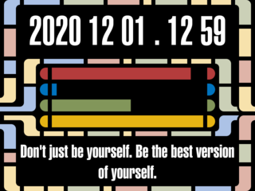
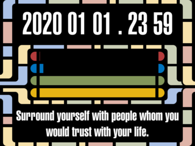
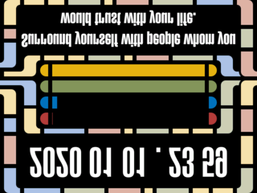

# lcarsclock for SPI display using bash, bc, imagemagick and fortunes

This small project aims at utilizing a simple SPI display connected to a
raspberry Pi. Refere to
[/schneirob/rpidualili9341](https://github.com/schneirob/rpidualili9341 "How to connect two SPI displays with ili9341 chipset to one Raspberry Pi")
for further information.

# The clock

The clock shows the time in "space time" 'yyyy mm dd . hh mm'. The four bars
represent the percentage of the year (red), month (blue), day (green) and hour
(yellow) that has already passed. If the red bar reaches the far right side,
its time to meet your anual targets! If the green bar reaches the far right,
its time to go home!

# Sending an image to an SPI display via the framebuffer device

These displays use RGB565 - meaning two bytes per pixel - for their color
representation. The display used in this project utilizes a display of 320x240.
320 x 240 x 2 = 153 600 - so writing 153 600 bytes to a frame buffer device
will create a full screen picture on the display

Due to the pixel writing direction of the displays used here, the image had to
be fliped to be shown correctly. Imagemagick can be used to easily convert a
correctly sized png into an bmp suited for SPI displays.

~~~bash
convert test.png -flip -type truecolor \
        -define bmp:subtype=RGB565 \
        test.bmp
~~~

~~~bash
pi@raspberrypi:~/lcarsclock $ file test.bmp 
test.bmp: PC bitmap, Windows 98/2000 and newer format, 320 x 240 x 16
pi@raspberrypi:~/lcarsclock $ du -b test.bmp 
153738	test.bmp
~~~

The 320x240 pixel image file is actually 138 bytes larger than expected due to
header information. Tail can be used to omit the header and select the correct
bytes from the image. 

~~~bash
tail --bytes 153600 test.bmp > /dev/fb1
~~~

The presented code is not optimized to easily support different screen sizes.
The publication is ment to be a motivation to create your own work of art with
a Raspberry Pi and a SPI display.

# Requirements

~~~bash
sudo apt install bc imagemagick fortunes
~~~

# Create a fortune file

~~~fortune
first fortune
%
second fortune
%
multi
line
fortune
%
~~~

~~~bash
strfile fortunefile
~~~

# run the clock every minute

~~~crontab
# m h  dom mon dow   command
* * * * *	/home/pi/lcarsclock/lcarsclock.sh &>> /dev/null
~~~

To cut time lag to a minimum, the next miniute image is always pre-generated by
the script. Never the less, a clock utilizing this method will always be
theruntime of the script late.

# usage

Normal usage is to create "now" if it does not already exists and "now+60" to
be set for the upcoming minute.

~~~bash
./lcarsclock.sh
~~~

If passing -d, debug mode is enabled and file deletion is omitted.

~~~bash
./lcarsclock.sh -d
~~~

To generate specific times pass them on the command line

~~~bash
./lcarsclock.sh "2020-02-04 23:48"
./lcarsclock.sh -d "2020-02-04 23:48"
~~~

There is no check, wether command line options are used as intended. Use them
wrong on your own risk.

Have fun!
